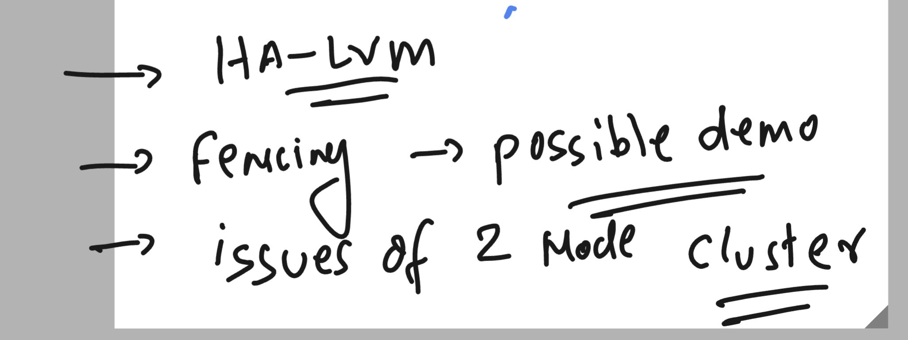
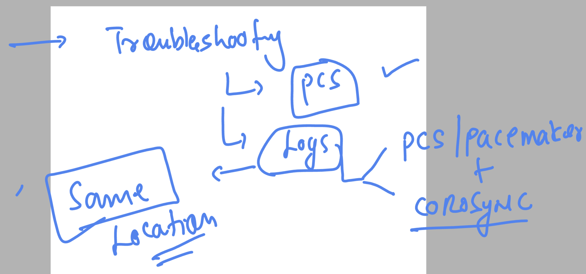
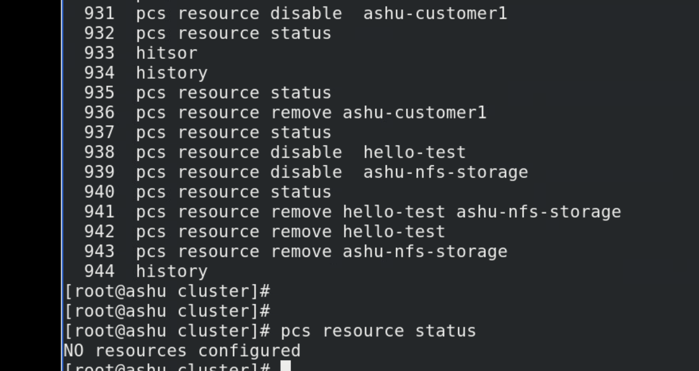
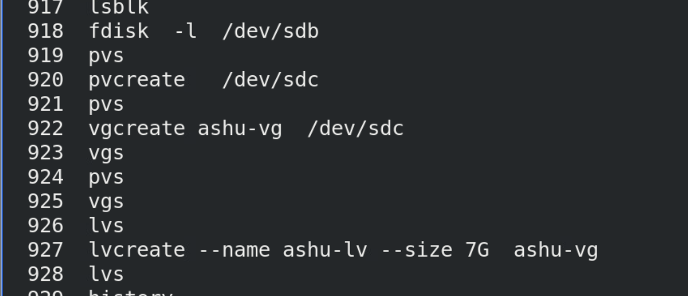
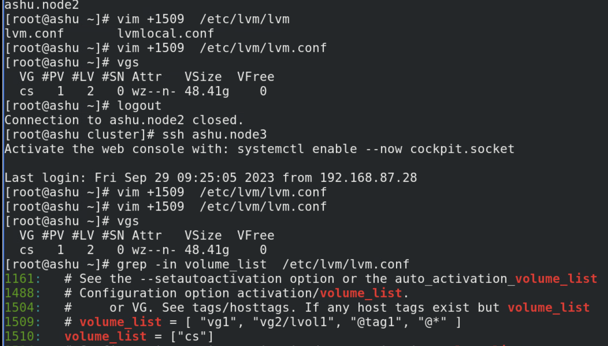
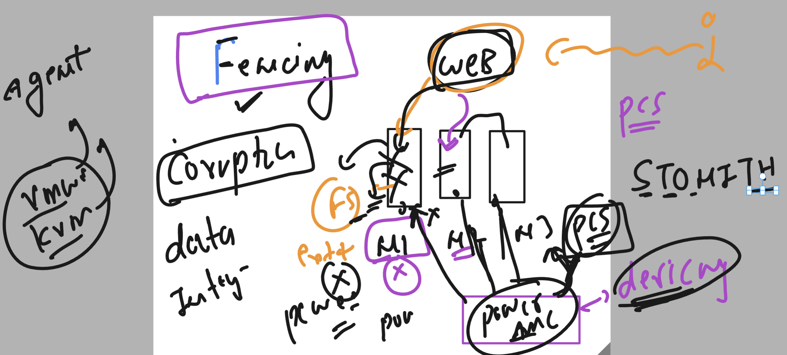

# tcs-linux-clustering

### target

### logs and pcs

## disable and remove resource 

### creating LV from iscsi disk 

### for pcs you have to let your linux kernel know which volume to activate by default 

## fencing 

