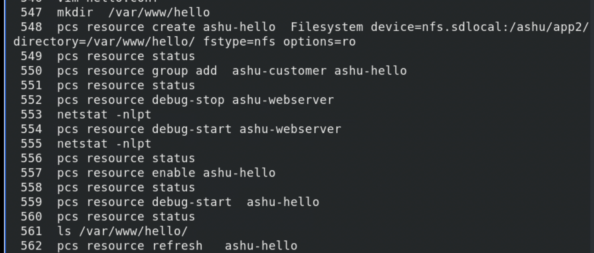

### moving forward

### using resources 

### creating ashu-customer resource group with IPaddr2 resource in it

### CREATING storage in same 

### creating indepent resource and adding into agroup 

